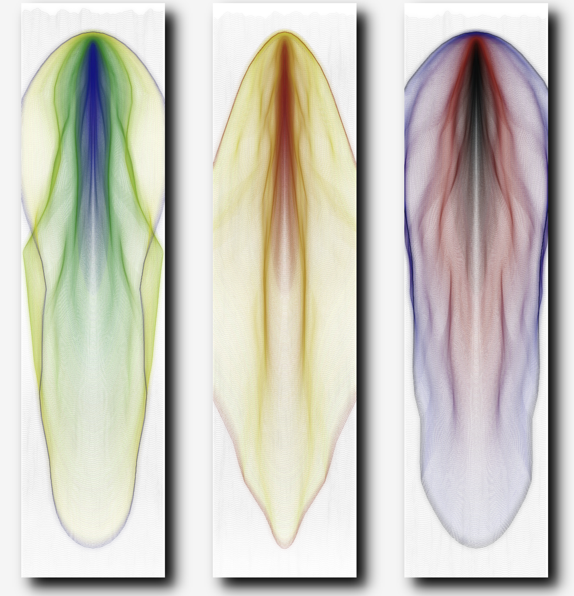

# tut5_GroupB_yliu0816
# Interactive Oil-Paper Umbrella Visual System (User Input)

## Project Overview
- This project is a generative visual animation created using p5.js, inspired by tranditional Chinese oil-paper umbrellas

- When users click on the canvas, an umbrella pattern and ink ripple effect are generated at the position

- Press number keys(1/2/3/0) to change the ink drop color

- The visual integrate rotational symmetry, bezier curves, ripple overlays, and soft color palettes to simulate aestheic texture of traditional Chinese design

## How to use
- Click anywhere on the Canvas to generate an umbrella pattern and ink ripple

- Press key '1', '2', '3' to change to a predefined ink drop color

- Press key '0' to use a random color from a traditional Chinese ink palette

- The canvas supports "multiple clicks", each click adds a new umbrella and link pattern

 ## Technical Detail
- Built with the p5.js framework

- Uses mousePressed() and keyPressed() to handle interaction events
 
- Dynamically generates umbrella patterns and ink ripple effects with object-oriented classes

- Simulates ink diffusion and paper transparency by layering semi-transparent ellipses

- Supports manual color switching with number keys:
 1, 2, 3: switch among preset traditional ink colors
 0: generate a random Chinese-style color

- Two main custom classes are used:
 PatternCircle: draws the umbrella’s central decoration and radial pattern
 RippleCircle: creates ripple effects around the umbrella with fading ink drops

- Offscreen rendering is handled with createGraphics() to simulate blur and preserve performance

- Object-oriented structure is adopted to keep the code modular and maintainable

- - Each ink drop now includes **five layered circles** with increasing size (`d`) and decreasing opacity (`alpha`) to simulate the gradient edge of real ink blots
- Used `map()` function on loop index `k` to control each layer's diameter and alpha
- This creates a softer, more realistic transition from dark center to light edge

## Visual Design Highlights

- Inspired by Traditional Chinese Oil-Paper Umbrellas
 The pattern on the umbrella reflects the elegant tones, symmetry and layering of oriental aesthetics

- Symmetrical Layout with Radial Geometry
 All elements are arranged symmetrically around the center, combining radial lines and Bezier curves to create a unified and rhythmic graphic structure

- Dynamic Bezier subtle rotation
 The central Bezier curve imitates the shape of an umbrella rib and rotates slightly, showing bionic vividness and delicate dynamics

- Ink Ripple Effect with Soft Diffusion
 Mouse clicks trigger the diffusion of the "umbrella surface", simulating the expansion of the umbrella when it is in use, enhancing the sense of reality

- Interactive Color Palette Inspired by Chinese Aesthetics
 Supports switching different styles of colors through buttons 1, 2, 3, 0: such as soft Chinese style colors such as light green, lotus root powder, blue gray, etc. Among them, 0 randomly generates elegant ink color, adding interactivity and personality expression

- Minimalist Background Enhances Focus on Interaction
 The overall background uses light beige (#f4f1e3), which fits the Chinese aesthetic tone and ensures that users focus on the ink droplet diffusion and umbrella structure

## Compare with my teammates
- One person tried to make tail effects with the dots

- Another focuses on a combination of expanding ripple effects and dynamic dots

- My version focuses on using Bézier curves and scale changes to enhance the visual dynamics and express the elegance of oil-paper umbrellas

## Inspiration
### Oil-Paper Umbrella

- The inspiration comes from the traditional Chinese oil-paper umbrella, with its symmetrical structure and poetic beauty. The radial skeleton of the umbrella and the floral design in the center are like a blooming flower, full of oriental artistic conception. The layered texture of thin paper and natural pigments on the umbrella in reality inspired me to simulate the diffusion and smudge effect of water waves through the program.

My design attempts to capture the fusion of "stillness" and "movement" - the regularity of the structure and the natural diffusion of the ink echo each other.

### Ink Chromatography by Ivan Rudnicki

[“Ink Chromatography” by Ivan Rudnicki](https://openprocessing.org/sketch/2613929)

- I was inspired by Ivan Rudnicki's generative art project "Ink Chromagraph". This work simulates the effect of ink spreading in water. I like this natural smudge effect. I hope to use this gradient and diffused image to give people a very intuitive visual change, meeting the assignment's requirements for beauty and creativity.

### Chinese traditional color
- [Color inspiration reference](https://pixso.cn/designskills/traditional-chinese-color-matching/)

## Improvements and Changes
- Modified the group code pattern ratio

- Modified the style of Bezier curve in group code

- Added a new `RippleCircle` class to simulate traditional ink diffusion with layered effects  

- Enabled rendering of multiple umbrellas by supporting repeated mouse clicks 

- Implemented interactive color switching using the number keys 1/2/3/0, based on a traditional Chinese color palette  

- Enhanced ink drop simulation with **multi-layer blurred circles** to mimic natural ink diffusion more realistically

These changes significantly improve both the interactivity and the aesthetic expression of the visual system.
 

